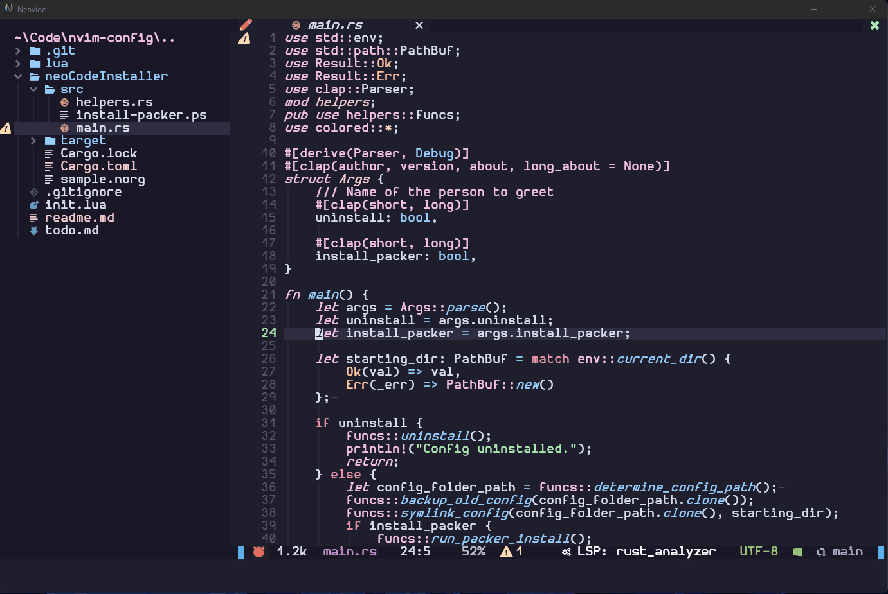

# Neocode
  Sane, simple, and effective config dedicated to replicating the out-of-box experience of vscode in Neovim.

There are many, many good Vim configs out there...many in which are better than this one. **BUT** I feel that the biggest barrier of entry for users switching from more traditional editors is the configuration. Who wants to spend hours and hours working on a config when VS code just fires up and is ready to go? Well...me...but not everyone is like me! This config is made to be a install-and-code config. Just clone the repo, run the installer, and you're ready to code!

The config was made to be a simple as possible. I think any setting you could need to change would be found right where you expect it to be.

 / ! 

Installer works for:
  - (most) linux distros
  - Windows 10/11
  - Mac OSX

## Dependencies [Windows]:
Make sure to enable developer mode.

Scoop package manager:
https://scoop.sh/

Build tools for Telescope FZF Native:
`scoop install make`
`scoop install gcc`

Neovim Nightly:
`scoop bucket add versions`
`scoop install neovim-nightly`

Neovide (reccomended):
https://github.com/neovide/neovide

(for building rust script from source)
Rust Lang:
https://www.rust-lang.org/tools/install

## Instructions
clone this repo somewhere easy to access on your pc. For example, I use ~\Code.

cd into the Neovide install directory, and simply run `./NeoCodeInstaller<yoursystem> --install-packer`

The install will be automatic and headlessly install all the needed plugins.

I just released the binaries today for Windows and Linux, please let me know if there are any issues with them!

## FAQ

- How do I get language support for a certian language?
type `:LspInstall` while the file is open and it should find a language server for you.

- How do I get syntax support for a language?
type `TSInstall ` and press `<tab>` and you will get an autocomplete window of available parsers.

## State of project
This project is literally brand new, and I am working on it alone. Some things may not work, and I may not have all the dependecies listed as they should be...if something is missing, please let me know.
## Commonly Used Keybinds:
- Show errors: `<space> q`
- move to next / prev diagnostic: `[d` or `]d`
- browse symbols: `<ctrl> o`
- Show file tree `<ctrl> b`
- rename symbol `F2`
- switch selected tab: `gt` and `gy`

## TODO:
- [ ] Set Neovide multigrid env var in installer script
- [ ] Have the installer install NERD front automatically (cross platform)
- [ ] (maybe) ship Neovide binary inside the installer to futher simplify the setup
- [ ] Set list of default installed language servers and treesitter parsers
